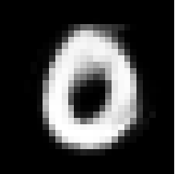
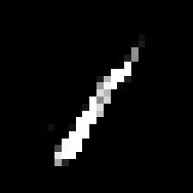
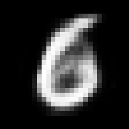
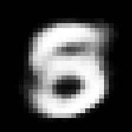

# Deep autoencoder with RBM pretraining

```Autoencoder.py``` defines a class that pretrains and unrolls a dense autoencoder, as described in "Reducing the Dimensionality of Data with Neural Networks" by Hinton and Salakhutdinov.  The layer dimensions are specified when the class is initialized.

Here are some MNIST samples that were generated by the decoder/generator from random noise after pretraining for 15 epochs and fine-tuning for 40 epochs (see Examples.ipynb).






## ```RBM.py```

This class implements a restricted Boltzmann machine.

## ```Autoencoder.py```

This class implements the pretraining of an autoencoder. It can be used as follows to replicate the autoencoder described by Hinton et al. to compress MNIST data.

    # initialize with specified layer dims for the encoder  
    autoencoder = Autoencoder(layer_dims = [784,1000,500,250,30])

    # perform greedy layer-wise training for a specified number of epochs using the RBM class defined above
    # num_samples is the number of samples generated by each layer for training the next layer  
    autoencoder.pretrain(x,epochs = 15,num_samples = 50000)    

    # after pretraining, you can save the pretrained weights
    autoencoder.save("pretrained_weights")

    # unroll the RBM layers into an autoencoder (a Keras model)
    model = autoencoder.unroll()

    # from here you can take the Keras model and fine-tune it as you wish
    model.compile(optimizer = 'rmsprop', loss = 'mse')
    model.fit(x.T,x.T,epochs = 20, batch_size=10)
    model.save("file.h5")

    
