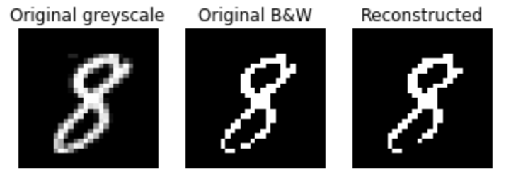
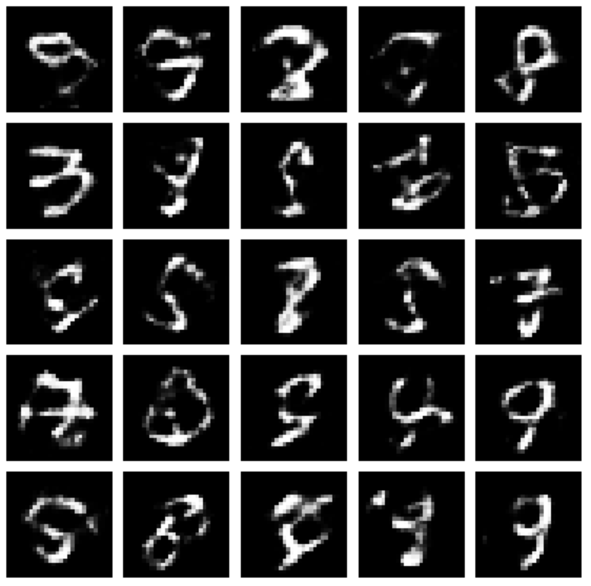
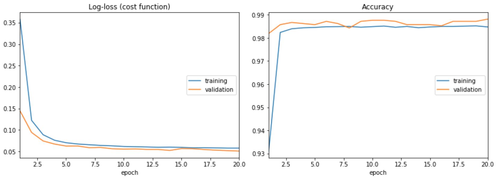

# Deep autoencoder with RBM pretraining

```Autoencoder.py``` defines a class that pretrains and unrolls a deep autoencoder, as described in "Reducing the Dimensionality of Data with Neural Networks" by Hinton and Salakhutdinov.  The layer dimensions are specified when the class is initialized.  In this repo I am trying to reproduce some of the results from that paper, as well as learn about autoencoders and Boltzmann machines. A longer discussion can be found in the notebook ``Examples.ipynb``.

In ``/src``, James Mracek is working on optimizing the code in ``RBM.py`` using AVC. 

## ```RBM.py```

This class implements a restricted Boltzmann machine.  Here is an example of what reconstructing a MNIST digit with the RBM looks like (see ``Examples.ipynb`` for more).



## ```Autoencoder.py```

This class implements the pretraining of an autoencoder. It can be used as follows to replicate the autoencoder described by Hinton et al. to compress MNIST data.

    # initialize with specified layer dims for the encoder  
    autoencoder = Autoencoder(layer_dims = [784,1000,500,250,30])

    # perform greedy layer-wise training for a specified number of epochs using the RBM class defined above
    # num_samples is the number of samples generated by each layer for training the next layer  
    autoencoder.pretrain(x,epochs = 15,num_samples = 50000)    

    # after pretraining, you can save the pretrained weights
    autoencoder.save("pretrained_weights")

    # unroll the RBM layers into an autoencoder (a Keras model)
    model = autoencoder.unroll()

    # from here you can take the Keras model and fine-tune it as you wish
    model.compile(optimizer = 'rmsprop', loss = 'mse')
    model.fit(x.T,x.T,epochs = 20, batch_size=10)
    model.save("file.h5")
    
(see ``Examples.ipynb`` for more details).

## Various results

The type of autoencoder studied in this repository is not designed for data generation. Nevertheless, here are some examples of what sampling with the decoder portion of the model looks like:



The encoder can be quickly adapted for classification by freezing weights and adding a few extra trainable layers.




    
